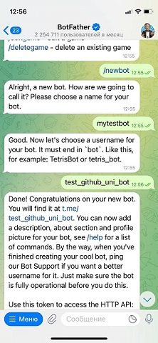

# Тест изменений

В ходе работы мы изменяем функционал бота: интерфейс, работу с базой, интеграцию с нейронками. Поэтому каждое изменение нужно протестировать локально, на своём тестовом боте.

## Параграфы
1. [Создание тестового бота](#как-создать-тестового-бота)
2. [Запуск теста на своем боте](#как-запустить-тест-на-своем-боте)
3. [Тест кода из Pull Request](#как-тестировать-код-из-pr)

## ❗️ Обязательно тестируй код на своем боте перед PR на `dev`! 

Во время Pull Request веток коллег мы тоже тестируем код на своих ботах. Тестов много не бывает 😉

## Как создать тестового бота?

1. Перейди в управляющий бот Телеграма: [Bot Father](t.me/BotFather)
2. Выбери команду `/newbot` и пройди процесс создания бота. Имя бота придумай сам

||
|:--:|
| *Создание бота в BotFather* |

3. Bot Father выдаст токен, вида `цифры:текст_и_цифры` и ссылку на тестового бота. Теперь у тебя есть твой бот

## Как запустить тест на своем боте?

1. В директории проекта создай файл `.env`. Подробнее о файлах `.env` по ссылке: [мануал на `.env`](https://github.com/yuramayer/project_bot/blob/manual/manuals/aiogram_README.md#1-env)
2. Файл `.env` должен выглядеть так:
```bash
BOT_TOKEN = 'ТОКЕН_СВОЕГО_БОТА_ОТ_BOT_FATHER'
OPEN_AI_API_KEY = 'OPEN_AI_API_КЛЮЧ'
DB_URI = 'URI_НА_БАЗУ_ДАННЫХ'
DB_NAME = 'ИМЯ_БАЗЫ'
```
> Некоторые переменные можно оставлять пустыми, вида `''`. Например, я не работаю с базой, тестирую только работу с Open AI, и оставляю такой `.env`:
```bash
BOT_TOKEN = 'ТОКЕН_СВОЕГО_БОТА_ОТ_BOT_FATHER'
OPEN_AI_API_KEY = 'OPEN_AI_API_КЛЮЧ'
DB_URI = ''
DB_NAME = ''
```
3. В директории проекта открывай консоль и прописыай команду:
```bash
python main.py
```
Ты должен получить сообщение вида:
```bash
2024-12-14 12:28:27,818 aiogram.dispatcher - INFO - Start polling
2024-12-14 12:28:27,818 - aiogram.dispatcher - INFO - Run polling for bot ...
```
4. Переходи в свой бот и тестируй команды

> Если ты оставил пустыми значения базы данных, то для теста закомментируй в хендлерах функции, которые работают с базой. Например, в `handlers/text.py` замени код:
```python
# db = Database()
# await db.store_prompt(message.text, str(message.from_user.id))
```
### ❗️ Перед пушем своей ветки верни все функции из-под комментариев!

## Как тестировать код из PR?

Ты проверяешь Pull Request и хочешь протестировать код. Правильно, что хочешь 😉

1. Открой свой проект, где ты кодишь 

2. Проверь, что у тебя сохранены все твои изменения. Если нужно - сохрани их на своей отдельной ветке, чтобы потом вернуться

3. Выполни в GitBash команду `git fetch`. Так ты получишь инфу о ветках из Git Hub. 

- В Кракене тоже есть кнопка `Fetch` сверху

4. Запусти в GitBash команду `git switch --track origin/НУЖНАЯ_ВЕТКА`. 

- В Кракене ветка сама появится слева, после `Fetch`. Нажми правой кнопкой мыши на нужную ветку и выбери `Checkout new branch`. 

Готово, ветка продулирована у тебя на локалке. Теперь тестируй её. Но ничего пушить на чужой ветке не стоит!
